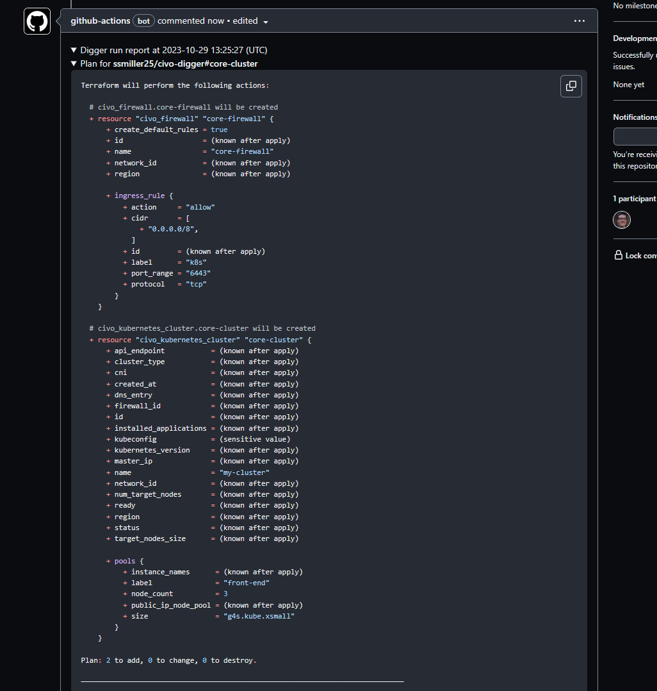

# Infrastructure as Code Using Digger

Terraform is a great tool for automating infrastructure configuration.  As your configuration and environemnt grows larger, and additional team members come in to help manage infrastrucutre, a better model needs to be in place to help run your Terraform code in a collaborative method.  Many solutions exist in the both the open source ([Atlantis](https://www.runatlantis.io/), [tf-controller](https://github.com/weaveworks/tf-controller)) and commercial ([Terraform Cloud](https://developer.hashicorp.com/terraform/tutorials/cloud-get-started/cloud-sign-up), [Env0](https://www.env0.com/), [Spacelift](https://spacelift.io/)). a solution that came to my attention recently was Digger. 

[Digger](https://www.digger.dev/) is an open-source tool that allows you to run all Terraform processes in the same CI infrastructure you already use. It reuses your CI infrastructure with jobs, logs, compute, orchestration, etc. so you can benefit from your your existing software deployment methodology.

To launch a Civo Kubernetes cluster using Digger.dev, you can follow these steps:

- In your Civo account, obtain an API token by going to [Settings -> Profile and clicking the Security tab](https://dashboard.civo.com/security)
- Create a new Github Repository.  
- In the new Github repository, go to Settings -> Secrets and Variables -> Actions.  Create a `CIVO_TOKEN` secret with the API key above
- In the New Repository, ensure you Github Actions, as well as grant the pipeline read and write permissions
    
- In the repository, create the following files (links provided with example code)
    - [core-cluster/provider.tf](https://github.com/ssmiller25/civo-digger/blob/1-infra-bootstrap/core-cluster/provider.tf)
    - [core-clutser/cluster.tf](https://github.com/ssmiller25/civo-digger/blob/1-infra-bootstrap/core-cluster/cluster.tf)
- Sketch out the Github Actions pipeline configuration and core digger configuraiton:
    - [.github/workflows/digger.yml](https://github.com/ssmiller25/civo-digger/blob/1-infra-bootstrap/.github/workflows/digger.yml) Main pipeline
    - [.digger.yml](https://github.com/ssmiller25/civo-digger/blob/1-infra-bootstrap/digger.yml): Digger confonfiguration itself
- Once everything has been committed to the `main` branch, you'll need to make a PR to actually test the pipeline.  Create a new branch, `initial-commit`.  Make a minor change to any of the terraform in the `core-cluster` directory.  Push up that branch, then create a new PR
- In that PR, write a new comment to trigger a `terraform plan` to see the actions the terraform code will perform.
    
- Review the output of the `terraform plan` output.  This will let you, and any peer reviewers, see what infrastructure changes will occur.
    
- If the plan looks good, then write a comment of `digger apply`.  
    
- On the PR, you will see the results of the terraform apply
    
- Once the apply is complete, merge your PR into the main branch.
- Once the pipeline has completed successfully, you can log in to your Civo account and verify that the Kubernetes cluster has been created.
    

Now we have completed our first cluster, provisioned completely from Digger!

This configuration will get you far - but we will explore hardening our pipeline with better state and lock management, but completely with Civo architecture!