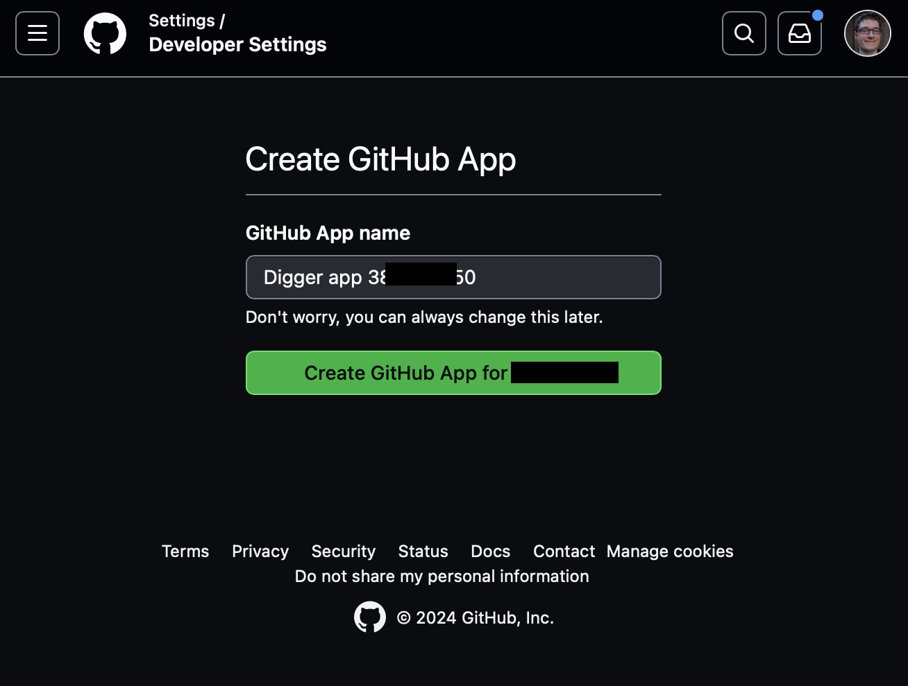

# Hardening our Infrastructure as Code Pipeline with Digger

In [Part 1](blog-article-1-infra-bootstrap.md) of our blog series, we setup a simple Digger pipeline to perform infrastructure as code (IaC) deployments all withing a GitHub pipeline.  But what if we wanted to expand such a deployment for a larger installation, or want it hardened for production deployments.  We will look at deploying the [Orchestrator Backend](https://docs.digger.dev/readme/howitworks)

## The Orchestrator Backend

The Orchestrator Backend is a service that triggers Pipeline Runs.  Most CI pipeline runs are usually triggered by events within the source code management system - code commits, pull requests, and other internal activity.  Most CI systems also provide a way for CI activities to be triggered externally.  And that is what the Digger Orchestrator uses to help build a configuration that will work more efficiently with multiple users and larger environments.

- Quicker response to PR comments and faster status check updates
- Parallelization where appropriate  
- Appropriate queuing with multiple PRs
- PR Level locks


## Cert-Manager

As we will be exposing a webhook on a public address for GitHub itself to call, we need to ensure we leverage a signed TLS certificate. The easiest way to configure one is to leverage the `cert-manager` Civo Marketplace app.  The core cert-manager is installed, but need some configuration.   The following will setup a cluster-issuers to let us continue.

```sh
# Install the kubeconfig for your digger cluster
civo k3s config -save core
kubectl config use-context core
# Setup a cluster-issuer to for Let’s Encrypt
kubectl apply -f - <<EOF
apiVersion: cert-manager.io/v1
kind: ClusterIssuer
metadata:
  name: letsencrypt-prod
spec:
  acme:
    email: ****REPLACE-WITH-EMAIL****
    preferredChain: ""
    privateKeySecretRef:
      name: prod-letsencrypt-key
    server: https://acme-v02.api.letsencrypt.org/directory
    solvers:
    - selector: {}
      http01:
        ingress:
          class: traefik

EOF
```

Record the default URL for the cluster.  We will use that as our default ingress domain name for the webhook.  (Note: you could use a custom domain if you wish)

```sh
civo k3s show core
# Make a note of the "DNS A record" information
```
## Installing Digger with Helm

Helm makes it easy to deploy complex applications on Kubernetes. Let's start by adding the Digger Helm repository and installing the chart:

```sh
cat - > values.yaml <<EOF
digger:
  ingress:
    enabled: true
    annotations:
	  cert-manager.io/cluster-issuer: letsencrypt-prod
	  kubernetes.io/ingress.class: traefik
	# Must laster be removed, but must be here for install install
	className: traefik
    host: 0123456abcd-fefe-1010101.k8s.civo.com #Replace with cluster DNS A record, from above
    tls:
      secretName: digger-backend-tls
  secret:
    # CHANGE BELOW!!!
    httpBasicAuthUsername: civoadmin
    httpBasicAuthPassword: REPLACEPASSWORD76341
    bearerAuthToken: "22321cdede" # You should generate with something like openssl rand -base64 32
    hostname: https://0123456abcd-fefe-1010101.k8s.civo.com #Replace with cluster DNS A record, from above, with https:// protocol ahead of it.
    githubOrg: "myorg" #replace with your GitHub organization
    # Replace below, AFTER GitHub setup process
	  # githubAppID: ""
    # githubAppClientID: ""
    # githubAppClientSecret: ""
    # githubAppKeyFile: #base64 encoded file
    # githubWebhookSecret: ""
postgres:
  enabled: true
  secret:
    useExistingSecret: false
    password: "testpass123"
EOF


helm repo add digger https://diggerhq.github.io/helm-charts/
helm repo update 
helm install digger digger/digger-backend --namespace digger --create-namespace -f values.yaml
```

This command installs Digger in its own namespace, keeping our cluster organized. After installation, you'll need to configure Digger to work with your GitHub organization.  Wait until all pods come up - it may take a few minutes for the postgres database to come up.

```sh
kubectl get pods -n digger
```

You will need to delete the `.spec.ingressClassName`  from the Ingress that is created for the cert-bot to work with the version of Traefik installed by default

```sh
kubectl edit ingress -n digger
```

## Setting Up a GitHub Organization

Go to https://CIVO_CLUSTER_URL/ and log in using the basic auth username and password above

Next, go to https://CIVO_CLUSTER_URL/github/setup to start the GitHub app set.

You will see a screen similar to below.  Review all the information, then click Setup.
 


GitHub will prompt for authentication information.  Then confirm the creation of a new GitHub app



You will return back to the Digger GitHub configuration screen.


Record the information, then edit the `values.yaml` in the original Helm configuration to fill out.  The appropriate names are commented out, so they just need to be uncommented and filled out correctly.  Once complete, reapply the values to the installed helm application.

```sh
helm upgrade digger digger/digger-backend --namespace digger -f values.yaml
```

**Make sure to also delete the `.spec.ingressClassName` attribute from the Ingress after application**

```sh
kubectl edit ingress -n digger
```

After applying the helm configuration, click the link provided on the GitHub setup screen - should be something like `https://github.com/apps/digger-app-111111111/installations/new`, only the `1s` replaced with random numbers assigned by GitHub.  This will complete the configuration!


## Configuring Digger

Now that we have our GitHub App set up, let's configure Digger in the pipeline to use it!  It will be the same as the our part 1 article, we just adjust a few parameters to make it work [add a parameter for the digger URL](https://github.com/diggerhq/digger/blob/develop/action.yml#L115C1-L118) to specify the URL for your digger hosted installation.

```yaml
      - name: digger run
        uses: diggerhq/digger@latest
        with:
         digger-hostname: https://0123456abcd-fefe-1010101.k8s.civo.com #Replace with cluster DNS A record, from above, with https:// protocol ahead of it.
          # To Disable all locking
          #disable-locking: true
          #no-backend: true
```


## Conclusion

Congratulations - your are now self-hosting digger!  A few items you may wish to look at as you expand.

* The database is currently self-hosted within Kubernetes.  You may want to layer a backup system on this, or hosted the Postgres database on more resilient architecture. Do keep in mind that all important configuration remains in the pipeline and runners.
* You only need to run this configuration if you have a high risk of concurrent PR operations. For smaller organization, just running stand-along digger without locks should work - just potentially minor delays in running.